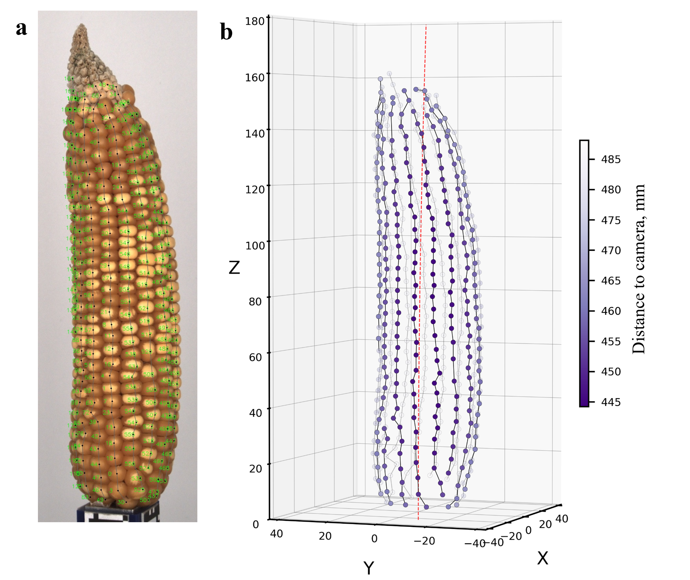

# Accurate 3D Maize Ear Phenotyping Using Voxel Grids Derived from RGB Machine Vision


This repository contains relevant code of the submitted manuscript by Oehme et al. (2026) 

The code is structured in 3 main modules:
1. **ear_scanner_control**: Image capture and UI
1. **kernel_ai_experiments**: Training and testing of maize kernel object detection and instance segmentation
1. **ear-traits**: Imaga analysis pipeline to prect various maize ear traits
    
## Installation

### AI Training and Image Analysis Pipeline

#### Hardware Requirements

Recommended hardware:

- **RAM:** 128 GB
- **GPU:** CUDA12-enabled NVIDIA GPU with at least 24 GB of VRAM

The pipeline has also been tested with reduced voxel resolution on lower-spec hardware:

- **RAM:** 32 GB
- **GPU:** CUDA12-enabled NVIDIA GPU with 16 GB of VRAM

#### Software Requirements

Recommended software environment:

- **Operating system:** Ubuntu 22.04 LTS
- **Python:** 3.10

Newer Python versions are expected to work, although only Python 3.10 has been tested. Other Linux distributions may also work, but Ubuntu 22.04 LTS is the only one tested.

#### Dependencies

Activate a virtual environment and run:
```
pip install -e .
```

Clone and build the apriltags repo as indicated in the README of `https://github.com/AprilRobotics/apriltag`.
Next create a pth-file in your venv at `.venv/lib/python3.10/site-packages/apriltag.pth`. The pth-file should containe an absolute path to the apriltag build folder.


## Run the image analysis
Inside an activated venv with all dependencies setup run:
```
python -m ear_traits.main -d "<path-to-image-folders>" --sam <path-to-sam1-weights>.pth --yolo <path-to-yolo8-weights> -e "<experiment-name>"
```
For further possible CLI args and explanations see the folowing section.
Original maize ear images will be made available upon reasonable request.
### Command-Line Arguments

| Argument              |    Type |               Default | Description                                                                                                                    |
| --------------------- | ------: | --------------------: | ------------------------------------------------------------------------------------------------------------------------------ |
| `-d`, `--root_dir`    |   `str` |              Required | Path to the root directory containing the ear folders.                                                                         |
| `-e`, `--exp_name`    |   `str` |              Required | Identifier used for naming result files and error files.                                                                       |
| `--show`              |  `flag` |               `False` | Show the kernel tracking process and save diagnostic images in the `diagnostic_images` folder.                                 |
| `--reference`         |  `flag` |               `False` | Enable loading of reference data.                                                                                              |
| `--no_voxel_carving`  |  `flag` |               `False` | Disable voxel carving for ear volume estimation. Voxel carving is enabled by default.                                          |
| `--no_kernel_count`   |  `flag` |               `False` | Disable kernel counting. Kernel counting is enabled by default.                                                                |
| `--no_sam_seg`        |  `flag` |               `False` | Disable kernel segmentation with SAM. SAM segmentation is enabled by default.                                                  |
| `--no_saving_results` |  `flag` |               `False` | Disable saving results to CSV files. Saving results is enabled by default.                                                     |
| `--archive_imgs`      |  `flag` |               `False` | Archive images.                                                                                                                |
| `--hsv_thresh`        |   `str` | `background_hsv.json` | Path to the JSON file storing HSV threshold values.                                                                            |
| `--yolo`              |   `str` |     `KernelYOLO8x.pt` | Path to the YOLO model file.                                                                                                   |
| `--sam`               |   `str` |     `KernelSAM_b.pth` | Path to the SAM model checkpoint.                                                                                              |
| `--jetson`            |  `flag` |               `False` | Use the pipeline configuration adapted for the Jetson Orin Nano.                                                               |
| `--mm_per_voxelside`  | `float` |                 `0.5` | Voxel grid resolution in millimeters per voxel side.                                                                           |
| `--yolo_engine`       |   `str` |                `None` | Build and use a YOLO engine to potentially speed up processing. Supported quantization options are `int8`, `fp16`, and `fp32`. |
| `--debug`             |  `flag` |               `False` | Disable error catching for debugging.                                                                                          |
| `--krow_assignment`   |  `flag` |               `False` | Assign detected kernels to kernel rows.                                                                                        |
| `--first_i`           |   `int` |                `None` | Start processing at the given loop index.                                                                                      |
| `--last_i`            |   `int` |                `None` | Stop processing at the given loop index.                                                                                       |
| `--output_dir`        |   `str` |              `./Result` | Path to the output directory.                                                                                                  |

## Run the AI training and testing
Relevant code for AI training and testing can be found in `kernel_ai_experiments`.

To run the AI training and testing make sure you have organised training data sumarized in a YOLO style yaml file. Make according changes in the lists of `BACKBONES` and `DATASET_YAMLS` in `kernel_ai_experiments/TRAIN_TEST_EXPERIMENT.py`. Original YOLO and SAM weights may be retrieved from Ultralytics and Meta AI, respectively. Our original training data as well as the trained model weights will be made available upon reasonable requests. 

Inside activated venv run:
```
python kernel_ai_experiments/TRAIN_TEST_EXPERIMENT.py
```

## Run the ear scanner control

The ears canner control requires a Jetson Orin NANO Microcomputer and a Raspberry Pi Pico microcontroller. The Pico is connected via USB to the Jetson and gets commands via serial interface to coordinate stepper motor movements.

On the Jetson, installation of dependencies and controling the ear scanner is both done by running:
```
chmod +x scanning_pipeline.sh
./scanning_pipeline.sh
```


